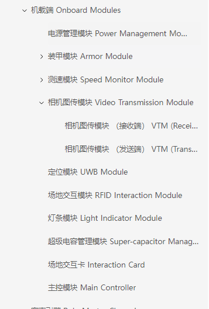
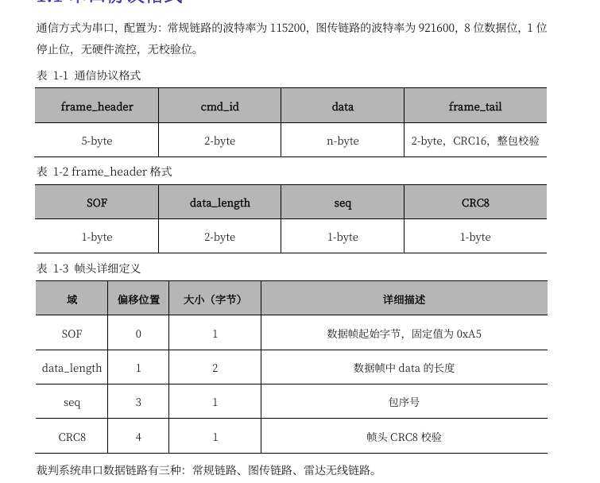

### 裁判系统学习篇

## 1. 了解裁判系统的硬件有哪些，一个地面兵种需要装哪些裁判系统，分别有什么作用
- 官网链接为 https://bbs.robomaster.com/wiki/20204847/811363?source=7


## 2. 了解裁判系统的软件有哪些，各个软件的作用分别是什么
- 官网链接为 https://bbs.robomaster.com/wiki/20204847/804683?source=7
- RoboMaster Tool 2用于升级裁判系统固件
- 安装RMUL 2026赛事引擎选手端 + 如何使用
## 3. 学习如何通过单片机与裁判系统通信
- 首先下载RMUC2026赛事通信协议文件，下载地址为 https://bbs.robomaster.com/forum.php?mod=attachment&aid=MjM5NjA5N3xwb2x1d29lM3w6Y29t&nothumb=yes&source=7
- 移植RMUC-2026的main分支的dvc_referee.cpp文件，要求实现裁判系统与单片机通信，请注意：仓库的裁判系统协议还未更新到最新版本，所以在调试时需要仔细观察通信协议文件，确保通信协议正确。
## 4. 验收裁判系统学习篇的点
- 1 .写一篇较为详细学习记录，关于裁判系统硬件的了解+使用+软件的学习记录。
- 2 .软件上 : 仔细阅读RMUC-2026赛事通信协议文件，重点学习数据包的传输方式+帧格式，c板与电源管理模块进行通信，最后完成对裁判系统的一些数据解包：Struct_Referee_Rx_Data_Robot_Status、Referee_Command_ID_ROBOT_POWER_HEAT，要求截图并上传到github。
- 3 .电管+C板在会这周三、四晚上提供，注意请在实验室9021使用。

### 裁判系统通讯之绘制UI篇
## UI通识的认知
- 什么是UI呢，即客户端显示的界面，它起到人机交互的作用，在赛场中摩擦轮的运行状态如何知道呢，那就取决于UI的绘制信息了，可以绘制一个信号：红色表示关闭状态、绿色表示开启状态。
## UI绘制大致思路
- 那么如何绘制UI呢，很简单，在已经学习了接收裁判系统的数据并解包后，相信大家已经了解了裁判系统的通讯方式UART，now，我们只需要把接收的所有的步骤倒过来做就可以了，即要绘制一个矩形，就通过查询它的对应的数据协议，最后整合为一整个包，发送出去就好。
- 清楚的指明了数据包的格式
 
 
-  封装成代码架构的样子，聪明的你肯定发现`CRC16整包校验`怎么不见了，这个大家可以思考下。
```
    /**
    * @brief 裁判系统源数据
    *
    */
    struct Struct_Referee_UART_Data
    {
        uint8_t Frame_Header = 0xa5;
        uint16_t Data_Length;
        uint8_t Sequence;
        uint8_t CRC_8;
        Enum_Referee_Command_ID Referee_Command_ID;
        uint8_t Data[121];
    } __attribute__((packed));

```
## UI绘制详细步骤
- 首先，你需要知道自己要绘制什么图形吧？当然这是官方规定的，大家可以自己去查我们可以绘制哪些图案，他们又有什么特征。下边我将通过手把手教大家如何绘制一个矩形，
 首先大家要先了解如何按照官方规定的协议来封装数据包！这很重要，真正掌握数据包的内部协议才是绘制UI最重要的一点，
- 因此，我们直接通过代码来解析每一步
```
    /**
    * @brief UART通信发送UI函数
    *
    * @param Graphic_1 图形地址
    */
    void Class_Referee::UART_Send_Interaction_UI_Graphic_1(Struct_Referee_Data_Interaction_Graphic_Config *Graphic_1)
    {
        Struct_Referee_UART_Data *tmp_buffer = (Struct_Referee_UART_Data *) UART_Manage_Object->Tx_Buffer;

        // 裁判系统帧头
        tmp_buffer->Frame_Header = 0xa5;
        tmp_buffer->Data_Length = sizeof(Struct_Referee_Tx_Data_Interaction_Graphic_1) - 2;
        tmp_buffer->Sequence = Sequence;
        tmp_buffer->CRC_8 = Verify_CRC_8((uint8_t *) tmp_buffer, 4);
        tmp_buffer->Referee_Command_ID = Referee_Command_ID_INTERACTION;

        // 交互帧头
        Struct_Referee_Tx_Data_Interaction_Graphic_1 *tmp_data = (Struct_Referee_Tx_Data_Interaction_Graphic_1 *) tmp_buffer->Data;
        tmp_data->Header = Referee_Interaction_Command_ID_UI_GRAPHIC_1;
        tmp_data->Sender = Robot_Status.Robot_ID;
        tmp_data->Receiver = static_cast<Enum_Referee_Data_Robots_Client_ID>((int) (Robot_Status.Robot_ID) + 0x100);

        // UI发一个图形帧内容
        tmp_data->Graphic[0] = *Graphic_1;

        tmp_data->CRC_16 = Verify_CRC_16((uint8_t *) tmp_buffer, 7 + tmp_buffer->Data_Length);

        HAL_UART_Transmit(UART_Manage_Object->UART_Handler, (uint8_t *) tmp_buffer, 7 + sizeof(Struct_Referee_Tx_Data_Interaction_Graphic_1), 100);

        Sequence++;
    }
```
- 帧头的封装：帧头一共有5个字节，成员变量如上图中frame_header所示，帧头为0xA5，数据帧的data的长度指的是什么呢：机器人交互数据的长度，在手册中命令码ID为0x0301,
  在手册中的代码为下图所示，user_data[x]有多种内容，可根据子内容ID进行选择，我们选择0x0101绘制一个图形。
    ```
    typedef _packed struct 
    { 
    uint16_t data_cmd_id; 
    uint16_t sender_id; 
    uint16_t receiver_id; 
    uint8_t user_data[x]; 
    }robot_interaction_data_t; 
    ```
    - 画一个图形的代码体现如下，也可以理解数据帧的data的长度显然就是Struct_Referee_Tx_Data_Interaction_Graphic_1的去掉CRC_16的大小，Sequence自己定义就好，尽量不要重复，因此++就可以，最后计算帧头的CRC8校验，至此帧头计算完成。
    ```
    /**
    * @brief 裁判系统接收的数据, 0x0301画一个图形交互信息, 用户自主发送
    *
    */
    struct Struct_Referee_Tx_Data_Interaction_Graphic_1
    {
        uint16_t Header = Referee_Interaction_Command_ID_UI_GRAPHIC_1;
        Enum_Referee_Data_Robots_ID Sender;
        uint8_t Reserved;
        Enum_Referee_Data_Robots_Client_ID Receiver;
        Struct_Referee_Data_Interaction_Graphic_Config Graphic[1];
        uint16_t CRC_16;//这是
    } __attribute__((packed));
    ```
- 交互帧的封装