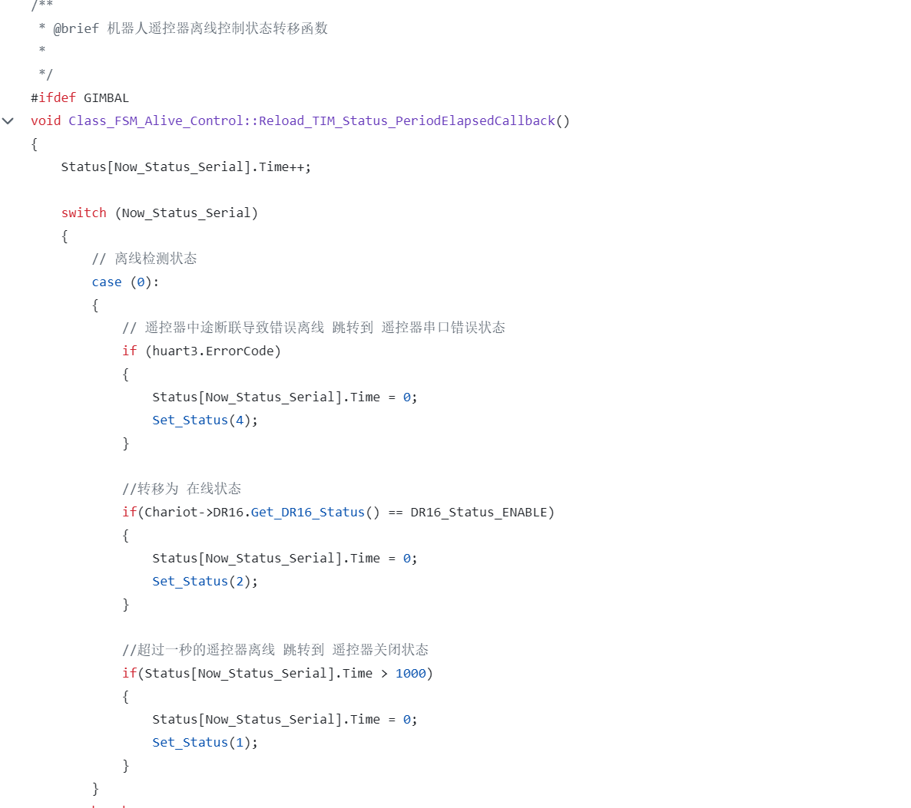

# 麦轮篇-规范
## 1. 软件移植的要求
- 自行移植RMUC-2025仓库的main分支代码，其中需要移植的库有：crt_chassis.cpp、dvc_djimotor.cpp(c620类函数中角速度环可以去掉内环的力矩部分)、dvc_dr16.cpp、drv_tim.cpp、drv_uart.cpp、drv_can.cpp、alg_pid.cpp、alg_fsm.cpp。
- 在使用遥控器控制时，需要移植ita_chariot.cpp里的遥控器离线状态机，使得在关闭遥控器时使得底盘无力，代码如下图所示：

## 2. 麦轮控制的要求
- 使得底盘在保持稳定状态下，能够在一定范围内响应遥控器的控制命令，完成使用遥控器遥感控制底盘的平移与自旋，并且能够在遥控器失效时，底盘保持底盘无力状态。
## 3.上传github仓库规范
- CODE
- 视频
- 麦轮控制篇.md
